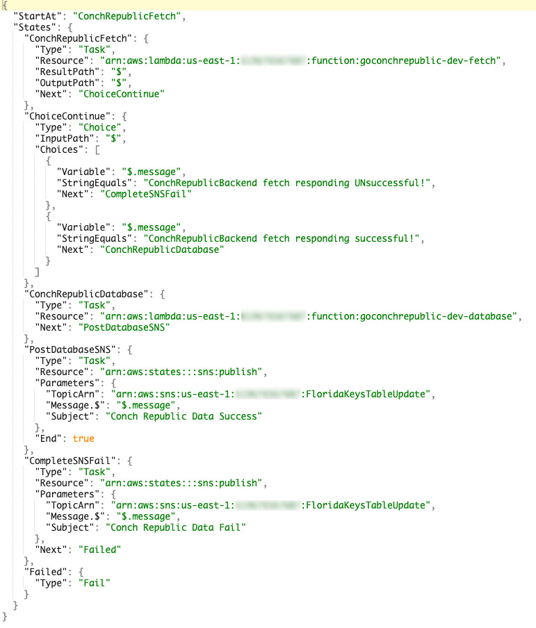

## GoConchRepublicBackend

This is a GO rewrite of a Java/Vertx backend application that collects, processes and inserts data into an 
AWS DynamoDB database supporting the Alexa Service - "The Conch Republic".

Whereas the Java/Vertx version uses a Vertx Message bus within one main Lambda application, this project 
is written to have separate go modules run as Serverless Lambda functions, coordinated via AWS Step Function 
processing. 

Process wise, there are 2 modules:
- fetch
- database

An **AWS Step Function** is invoked by way of a custom EventBridge cron event, and acts as an orchestrator starting the 'fetch' module first, 
and upon completion, starting the 'database' module to process all of the event items the fetch module placed into an SQS queue. At the end of the flow, 
the Step Function calls SNS to send a message of the result.

The **fetch** module's job is to perform an HTTP GET of Event Data for each of 12 months (where 1 is the current month, 12 is the 12th month from the current), 
extract event data from the HTML using "**github.com/PuerkitoBio/goquery**", and then 
create individual event details that can be provided as a JSON string message to be sent into an SQS queue. 

The **database** module is invoked as part of an AWS Step Function flow right after successful completion of the Fetch module.
 The database module polls/receives the items from SQS, and handles the insertion of the Event Data into a DynamoDB database 
 looping until all items in the batch have been processed. The 'timeout' for this lambda function is set to 60 seconds so as to add 
 some SQS Long polling capability. 
- Note: When Fetch provides EventData for the Database module to process, one of the columns passed is 
'**EventExpiry**', which contains a int64/epoch value calculated based on the Event's EndDate. DynamoDB is configured to use 
the EventExpiry column data as TTL - ultimately allowing for the records to auto-purge after the EndDate has just passed.

#### Step Function:

